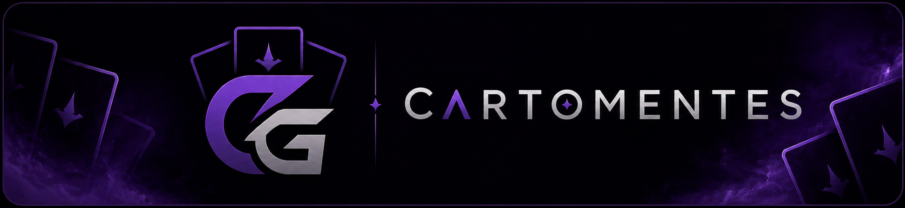

<!-- 

  

 -->

<!-- 

 -->

  

---

> [!IMPORTANT]
> Repositório dedicado à disciplina de Desenvolvimento Ágil (EC46C - C61 - 2026/01) do curso de Engenharia de Computação da Universidade Tecnológica Federal do Paraná, em Cornélio Procópio!
> 
> **Nome do projeto: Cartomentes!**

---

## Descrição do Projeto

> [!NOTE]
> Sistema para criação e gerenciamento de cartas personalizadas, permitindo ao usuário gerar, editar e organizar conteúdos de forma dinâmica.

---

<table align="center"><tr><td>
<h2>Integrantes</h2>
<table>
<tr><th>Nome</th><th>RA</th></tr>
<tr><td><a href="https://github.com/decosawa">Andre Luiz Goncalves da Silva Teixeira</a></td><td>2564289</td></tr>
<tr><td><a href="https://github.com/CgB-system">Carlos Gabriel Baratieri</a></td><td>2706598</td></tr>
<tr><td><a href="https://github.com/Emymoura">Emily Vitorya de Moura</a></td><td>2575337</td></tr>
<tr><td><a href="https://github.com/GustavoGracionali">Gustavo de Oliveira Gracionali</a></td><td>2618052</td></tr>
<tr><td><a href="https://github.com/phpaludetto">Pedro Henrique Paludetto</a></td><td>2649063</td></tr>
</table>
</td><td align="center">

</td></tr></table>

---

## 📁 Estrutura do Repositório (Árvore de Diretórios)

- 📁 [docs/](docs/)
  - 📁 [Prototipacao/](docs/Prototipacao/)
  - 📁 [RequisitosSistema/](docs/RequisitosSistema/)
  - 📁 [RequisitosUsuario/](docs/RequisitosUsuario/)
    - 📁 [HistoriasUsuario/](docs/RequisitosUsuario/HistoriasUsuario/HistoriasUsuario.md)
    - 📁 [RequisitosFuncionais/](docs/RequisitosUsuario/RequisitosFuncionais/RF.md)
    - 📁 [RequisitosNaoFuncionais/](docs/RequisitosUsuario/RequisitosNaoFuncionais/RNF.md)
- 📁 [atv/](atv/)
  - 📄 [README.md](atv/README.md)
- 📁 [src/](src/)
- 📁 [assets/](assets/)
  - 📁 [rascunhos/](assets/rascunhos/)
  - 📄 [README.md](assets/README.md)

> [!TIP]
> **docs/**: documentação do projeto.  
> **atv/**: atividades e entregas da disciplina.  
> **src/**: código-fonte da aplicação.  
> **assets/**: arquivos estáticos (imagens, ícones, etc).

---

  
<b>🗺️ Mapa Geral do Repositório</b>

  <pre><code>
├── assets
│   ├── rascunhos
│   │   ├── fluxorascunho.png
│   │   ├── login-rascunho.png
│   │   ├── racunho2.png
│   │   ├── rascuho1.png
│   │   └── rascunho3.png
│   └── README.md
├── atv
│   ├── pdf
│   │   ├── Atividade01.pdf
│   │   ├── Atividade02.pdf
│   │   ├── Atividade03.pdf
│   │   └── Atividade04.pdf
│   └── README.md
├── docs
│   ├── Prototipacao
│   │   └── README.md
│   ├── README.md
│   ├── RequisitosSistema
│   │   └── README.md
│   └── RequisitosUsuario
│       ├── HistoriasUsuario
│       │   └── HistoriasUsuario.md
│       ├── Prompt-Historias-Usuarios.docx.pdf
│       ├── README.md
│       ├── RequisitosFuncionais
│       │   └── RF.md
│       └── RequisitosNaoFuncionais
│           └── RNF.md
├── README.md
└── src
    └── README.md
  </code></pre>

--- 

# Tecnologias Utilizadas

<table align="center">
<tr><th align="center">Categoria</th><th align="center">Tecnologias</th></tr>
<tr><td align="center"><b>Back-End</b></td><td align="center"></td></tr>
<tr><td align="center"><b>Front-End</b></td><td align="center"></td></tr>
<tr><td align="center"><b>Docs & VCS</b></td><td align="center"></td></tr>
</table>

> [!NOTE]
> As tecnologias vão ser adicionadas conforme a evolução do projeto.

---

